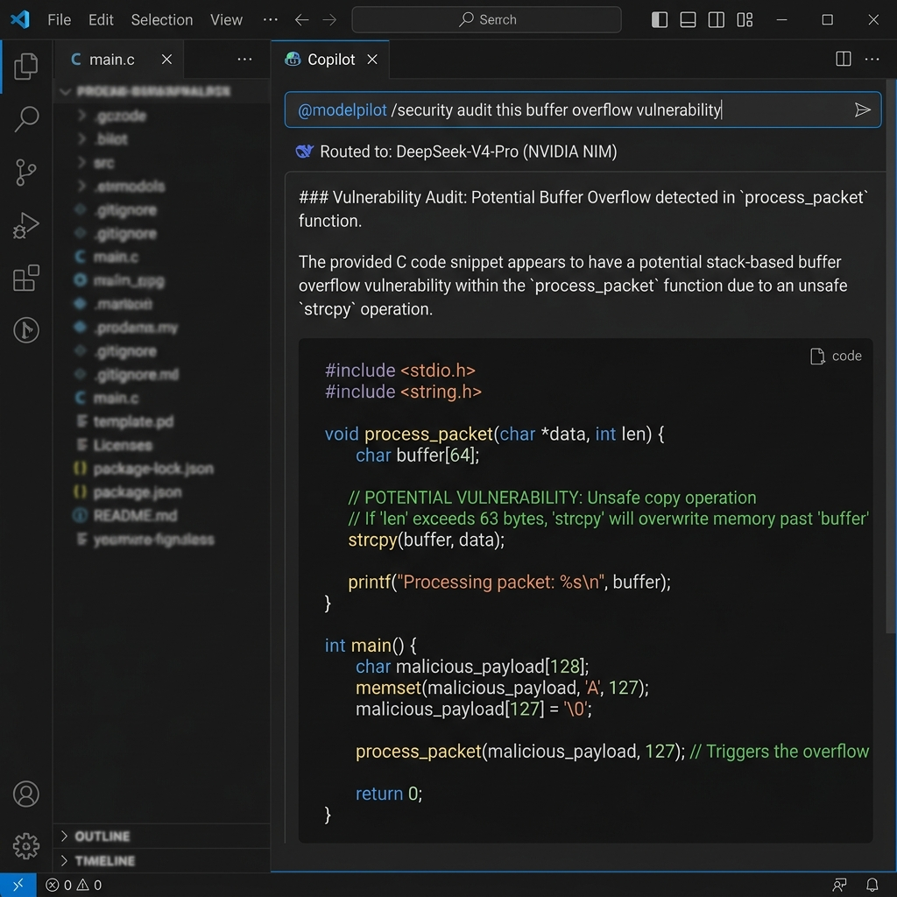
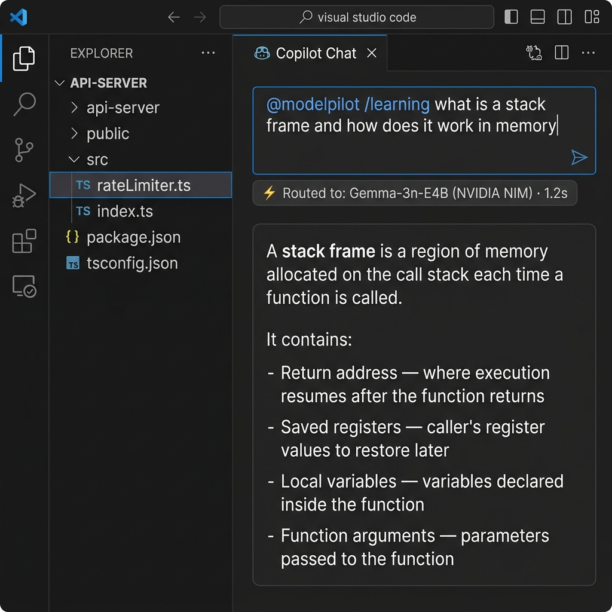
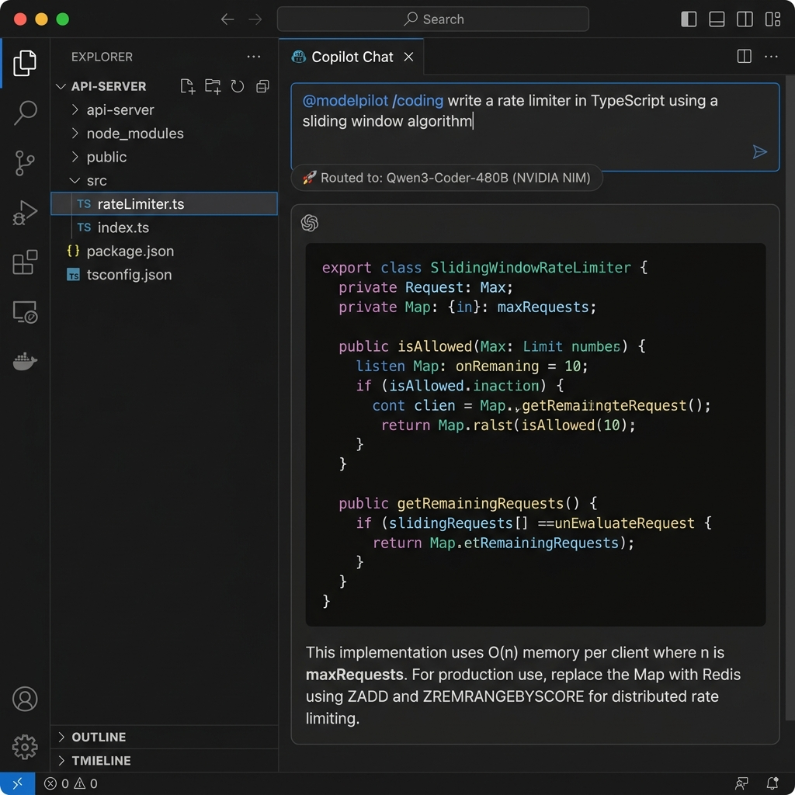

# ModelPilot

<p align="center">
  
</p>

<p align="center">
  <b>Free AI Coding Assistant · Multi-Provider · Workspace Agent · Copilot Chat Native</b>
</p>

<p align="center">
  
  
  
  
  
  
  
  
</p>

> **ModelPilot gives you the power of GitHub Copilot and Gemini CLI — for free —  
> by intelligently routing your requests across NVIDIA NIM, Groq, and OpenRouter.**

---

ModelPilot is a workspace-aware AI coding assistant integrated directly into VS Code as a native GitHub Copilot Chat Participant. It dynamically routes requests to the most suitable available model (across Groq, NVIDIA NIM, and OpenRouter) and runs an autonomous workspace agent loop to read, write, create, and delete files, or run terminal commands under a secure, human-in-the-loop approval system.

## Why ModelPilot?

GitHub Copilot's free tier is limited. Gemini CLI requires setup. NVIDIA NIM offers access to 95+ frontier models for free — but choosing the right one is overwhelming.

ModelPilot solves this. It automatically routes every request to the best available model for the task, across multiple free providers, with no manual model selection required.

| | GitHub Copilot Free | ModelPilot |
|---|---|---|
| Models available | 1–2 | 95+ |
| Providers | GitHub only | NVIDIA NIM, Groq, OpenRouter |
| Cost | Limited free tier | Free (bring your own key) |
| Agent tools | ✅ | ✅ |
| Model auto-selection | ❌ | ✅ |
| Security/CTF experts | ❌ | ✅ |

## Overview

Most AI coding assistants restrict you to a single model, provider, or subscription. ModelPilot lets you bring your own provider API keys, automatically routes each query to the best suited model, and leverages local workspace agent tools natively within the VS Code Chat interface.

## Screenshots

### 1. Security Analysis (Expert routing to DeepSeek V4 Pro on NVIDIA NIM)
<p align="center">
  
</p>

### 2. High-Speed Learning (Ultra-fast low-latency routing to Gemma 3n on Groq)
<p align="center">
  
</p>

### 3. Advanced Coding (Expert code generation via Qwen3 Coder 480B on NVIDIA NIM)
<p align="center">
  
</p>

## Quick Start

1. **Configure API Keys**: Open the VS Code Command Palette (`Ctrl+Shift+P` or `Cmd+Shift+P`) and run the command `ModelPilot: Add API Key`. Choose a provider (Groq, Nvidia NIM, or OpenRouter) and paste your API key.
2. **Start a Chat**: Open the VS Code Chat view (`Ctrl+Alt+I` or click the chat icon in the Activity Bar).
3. **Ask a Question**: Type `@modelpilot` in the chat, optionally add a slash command for a specific expert (e.g. `@modelpilot /security audit this login function`).

## Key Features

* **Copilot-Native Integration**: Fully integrated into the native VS Code Chat experience. Call ModelPilot anywhere using the `@modelpilot` handle.
* **Dynamic Model Routing**: Automatically scores and selects the most suitable available model from Groq, Nvidia NIM, and OpenRouter based on the query context.
* **Autonomous Agent Loop**: Solves complex tasks iteratively by chain-calling local workspace tools.
* **Smart Mode Routing**: Automatically detects user intent (Ask, Plan, or Agent mode) using a fast LLM intent classifier when no slash command is explicitly provided.
* **Safety-First Native Approvals**: Full control over your codebase. Any action that modifies files, deletes resources, or executes terminal commands prompts a modal VS Code warning dialog for approval.
* **Out-of-Workspace Guards**: Protects your system by warning you if terminal commands attempt to access paths outside the active workspace directory.
* **Secure Secret Storage**: API keys are securely managed using VS Code's system-level secure keychain (`SecretStorage` API).

## Expert Personas

ModelPilot tunes model selection using distinct weight scoring criteria for each profile. In chat, you can invoke them via subcommands:

| Subcommand | Expert Persona | Targeted Use Cases | Primary Capabilities |
| :--- | :--- | :--- | :--- |
| `@modelpilot /general` | General | Everyday chitchat, rapid low-latency answers | Fast/low-latency routing |
| `@modelpilot /coding` | Coding | Writing code, refactoring, and debugging | `coding` (60%), `reasoning` (30%) |
| `@modelpilot /reverse-engineering` | Reverse Engineering | Assembly reading, decompiling (Ghidra, IDA) | `security` (45%), `reasoning` (35%) |
| `@modelpilot /binary-exploitation` | Binary Exploitation | Buffer overflows, ROP chain script generation | `security` (50%), `reasoning` (35%) |
| `@modelpilot /web-security` | Web Security | Web payload design (XSS, SQLi, SSRF, SSTI) | `security` (50%), `reasoning` (35%) |
| `@modelpilot /malware-analysis` | Malware Analysis | PE/ELF structural triage, YARA writing, IOCs | `security` (50%), `reasoning` (35%) |
| `@modelpilot /cryptography` | Cryptography | Cipher attacks, custom encoding/decoding | `reasoning` (50%), `security` (35%) |
| `@modelpilot /linux` | Linux | Shell scripting, system admin, performance | `coding` (40%), `reasoning` (35%) |
| `@modelpilot /writing` | Writing | Reports, markdown articles, creative text | `writing` (65%), `reasoning` (25%) |
| `@modelpilot /documentation` | Documentation | API docs, JSDocs, and README creation | `writing` (50%), `coding` (35%) |
| `@modelpilot /learning` | Learning | Simplifications, tutorials, analogical breakdowns | `learning` (50%), `writing` (30%) |

## Supported Providers

| Provider | Free Tier | Best For | Models |
|---|---|---|---|
| **NVIDIA NIM** | ✅ Yes | Reasoning, Security, Coding | 95+ including DeepSeek V4 Pro, Qwen3 Coder 480B, Nemotron Ultra |
| **Groq** | ✅ Yes | Speed, Learning | Llama 3.3 70B, DeepSeek R1, Gemma 2 9B at ultra-low latency |
| **OpenRouter** | ✅ Free models | General, Writing | GPT-OSS 120B, Gemma 4 31B, Llama 3.3 70B |

You can configure multiple API keys per provider — ModelPilot automatically rotates between them on rate limits.

## Workspace Tools

When executing agent tasks, ModelPilot can request local workspace tools iteratively:

* **Directory Inspection**: View structure (`list_directory`) and check currently open editor tabs (`get_open_files`).
* **Workspace Search**: Concurrent workspace-wide code searches (`search_workspace`) to locate functions or variables.
* **File I/O**: Safely read files (`read_file`) and write/create files (`write_file`, `create_file`).
* **Integrated Terminal**: Execute commands (`run_terminal_command`) to run compilation, linters, or testing frameworks.

## Extension Settings

ModelPilot contributes the following settings to VS Code:

* `modelpilot.defaultExpert`: The default expert profile when opening a new chat. Default is `"coding"`.
* `modelpilot.streamResponses`: Stream responses token by token as they arrive. Default is `true`.
* `modelpilot.approvalMode`: The approval mode for workspace tools and terminal commands. Options are `"default"` (prompt for approval on all modifying operations), `"bypass"` (automatically approve all executions), or `"autopilot"` (run autonomously without human-in-the-loop approvals).
* `modelpilot.defaultMode`: The default mode of operation when no slash command is entered. Options are `"default"` (auto-detect), `"ask"` (conversational support), `"plan"` (plan formulation), or `"agent"` (autonomous task execution).

## Requirements

* **VS Code**: Version 1.120.0 or later.
* **GitHub Copilot Chat Extension**: Installed and configured.
* **API Keys**: Free accounts at any of:
  * [NVIDIA NIM](https://build.nvidia.com) — 95+ models free
  * [Groq](https://console.groq.com) — fastest inference free tier
  * [OpenRouter](https://openrouter.ai) — multiple free models

## Development

To build and run ModelPilot from source:

1. Clone the repository and install dependencies:
   ```bash
   npm install
   ```
2. Compile the extension:
   ```bash
   npm run compile
   ```
3. Open the repository in VS Code and press `F5` to launch the Extension Development Host.
4. Run unit and integration tests:
   ```bash
   npm run test
   ```

## Security

* **Explicit Modal Approvals**: Any action that modifies files, deletes resources, or executes terminal commands will trigger a native VS Code warning dialog message with modal constraints (`vscode.window.showWarningMessage`). No modifications are made without your explicit consent.
* **Out-of-Workspace Safety Warning**: ModelPilot tracks command execution boundaries. If a terminal command includes system paths or relative traversals outside your active workspace directory, the modal dialog prominently warns you about the boundary traversal.
* **Credential Handling**: Keys are securely handled via VS Code's system-level secure keychain (`SecretStorage`). Telemetry is entirely absent, and keys are never sent in plain-text configuration files.

For a detailed review of our security measures, please see [SECURITY.md](SECURITY.md).

## Privacy

* ModelPilot does not collect telemetry or usage metrics.
* API keys are stored securely using VS Code's native `SecretStorage`.
* Workspace content and codebase paths are only transmitted directly to the configured AI provider required to fulfill your completion requests.
* ModelPilot does not host or route requests through any intermediary servers.

For a detailed breakdown, please see [PRIVACY.md](PRIVACY.md).
