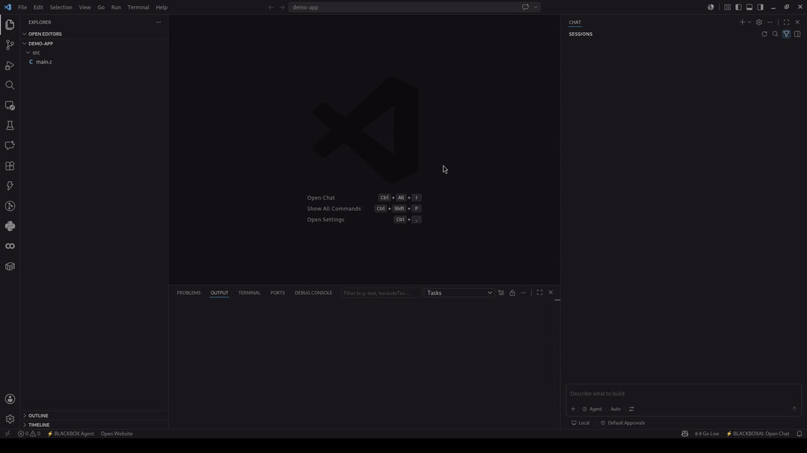

# ModelPilot

  

  <b>Multi-Provider AI Routing & Autonomous Workspace Agents for GitHub Copilot Chat</b>

  
  
  
  

---

ModelPilot is a workspace-aware AI assistant integrated directly into VS Code as a native GitHub Copilot Chat Participant. It dynamically routes developer queries to the most suitable LLM across multiple providers (NVIDIA NIM, Groq, OpenRouter, Cerebras, Google AI Studio, and Ollama) and executes tasks using an autonomous local agent loop.

  

---

## 🚀 Quick Start

1. **Install**: Search for "ModelPilot" in the VS Code Extensions marketplace, or install from a `.vsix` file.
2. **Add API Key**: `Ctrl+Shift+P` → `ModelPilot: Add API Key` → pick a provider and paste your key.
3. **Chat**: Open VS Code Chat and type `@modelpilot` followed by your request.
4. **Explore**: `Ctrl+Shift+P` → `Get Started: ModelPilot` to open the interactive walkthrough.

> **Tip:** After installing, VS Code will show the **"Get Started with ModelPilot"** walkthrough automatically. Complete all 6 steps to unlock the full feature set!

---

## ✨ Feature Overview

### Core Capabilities
| Feature | Description |
|---------|-------------|
| **Dynamic Model Routing** | Automatically evaluates and routes each query to the best-suited model based on task type |
| **Autonomous Agent Loop** | Solves complex tasks by chaining local tools (file read/write, terminal, search) in a stateful loop |
| **Native Integration** | Accessible via `@modelpilot` in Copilot Chat or VS Code's native model picker |
| **Multi-Key Rotation** | Automatically rotates API keys on rate limits across all providers |

### Productivity Commands
| Command | Description | Shortcut |
|---------|-------------|----------|
| **New Chat** | Open a new ModelPilot chat session | `Ctrl+Alt+M` |
| **Inline Chat** | Edit or generate code directly in the editor | `Ctrl+Alt+I` |
| **Prompt Templates** | 10 curated prompt templates for common workflows | `Ctrl+Alt+T` |
| **Refactor Selection** | Refactor selected code for readability and modern patterns | `Ctrl+Alt+R` |
| **Explain Code** | Explain selected code's behavior and edge cases | Right-click menu |
| **Fix Code** | Fix bugs and inefficiencies in selected code | Right-click menu |
| **Review Code** | Comprehensive code review with actionable feedback | Right-click menu |
| **Generate Tests** | Generate unit tests covering positive, negative, and edge cases | Right-click menu |
| **Generate Docstring** | Generate JSDoc/docstring for selected functions | Right-click menu |

### Chat Modes (Slash Commands)
| Mode | Description |
|------|-------------|
| `/ask` | Conversational support — no file modifications |
| `/plan` | Generate structured step-by-step implementation plans |
| `/agent` | Autonomous task execution with file, terminal, and search tools |
| `/terminal` | Generate shell command suggestions with "Run in Terminal" buttons |
| `/commit` | Auto-generate conventional commit messages from git diff and commit |
| `/export` | Export chat history as a Markdown file in the workspace |

### Speed & Analytics
| Feature | Description |
|---------|-------------|
| **Live Latency Counter** | Status bar shows last request latency in real-time |
| **Model Benchmark** | Test all available models and rank by tokens/second |
| **Token Analytics** | Dashboard with usage charts, cost savings, and model performance |
| **Model Arena** | Compare two models side-by-side on the same prompt |
| **Inline Completions** | Real-time ghost-text code suggestions as you type |

### Workspace Tools
| Feature | Description |
|---------|-------------|
| **Context Pinning** | Pin files to always include in every prompt context |
| **Code Search** | Regex search across your workspace with file filters |
| **Context Compression** | Strip comments/whitespace to reduce token consumption |
| **Custom Instructions** | Personalize responses via settings or `.modelpilot-instructions.md` |
| **MCP Servers** | Connect external tool servers via Model Context Protocol |

### Accessibility
| Feature | Description |
|---------|-------------|
| **High-Contrast Support** | All panels adapt to Windows High Contrast and forced-colors mode |
| **Focus Ring Styling** | Visible keyboard focus indicators on all interactive elements |
| **Reduced Motion** | Respects `prefers-reduced-motion` system setting |
| **ARIA Live Regions** | Screen reader announcements for dynamic content updates |
| **Lightbulb Quick Fix** | "Fix with ModelPilot" appears on diagnostics errors automatically |

---

## ⌨️ Keyboard Shortcuts

| Shortcut | macOS | Command |
|----------|-------|---------|
| `Ctrl+Alt+M` | `Cmd+Alt+M` | New ModelPilot Chat |
| `Ctrl+Alt+I` | `Cmd+Alt+I` | Inline Chat (Edit/Generate Code) |
| `Ctrl+Alt+T` | `Cmd+Alt+T` | Insert Prompt Template |
| `Ctrl+Alt+R` | `Cmd+Alt+R` | Refactor Selection |

---

## 🎯 All Commands

Open the Command Palette (`Ctrl+Shift+P`) and type **"ModelPilot"** to access:

| Command | Description |
|---------|-------------|
| `ModelPilot: Add API Key` | Add, delete, or manage provider API keys |
| `ModelPilot: View Available Models` | List all discovered models across providers |
| `ModelPilot: Refresh Models` | Re-scan all providers for available models |
| `ModelPilot: Select Expert Profile` | Switch between expert personas (coding, security, linux, etc.) |
| `ModelPilot: New Chat` | Open a new chat session with `@modelpilot` |
| `ModelPilot: Inline Chat` | Edit/generate code directly in the editor |
| `ModelPilot: Explain Code` | Explain selected code |
| `ModelPilot: Fix Code` | Fix bugs in selected code |
| `ModelPilot: Review Code` | Code review with feedback |
| `ModelPilot: Generate Tests` | Generate unit tests |
| `ModelPilot: Refactor Selection` | Refactor for readability |
| `ModelPilot: Generate Docstring` | Generate documentation comments |
| `ModelPilot: Insert Prompt Template` | Pick from 10 curated prompt templates |
| `ModelPilot: Benchmark Model Speeds` | Test and rank all models by speed |
| `ModelPilot: Pin File to Context` | Always include this file in prompts |
| `ModelPilot: Unpin File from Context` | Remove a file from pinned context |
| `ModelPilot: View Pinned Context Files` | See all pinned files |
| `ModelPilot: View Token & Cost Analytics` | Open the analytics dashboard |
| `ModelPilot: Open Model Comparison Arena` | Compare two models side-by-side |
| `ModelPilot: Open Code Search Panel & Indexer` | Search workspace with regex |
| `ModelPilot: Compress Context File & Copy` | Compress active file and copy to clipboard |
| `ModelPilot: Configure MCP Server` | Add, edit, or remove MCP servers |
| `ModelPilot: Toggle Inline Completions` | Enable/disable ghost-text completions |
| `ModelPilot: Run in Terminal` | Execute a command in the ModelPilot terminal |

---

## 🔧 Expert Profiles

Switch expert personas to optimize model selection and system prompts for your domain:

| Profile | Best For |
|---------|----------|
| `coding` | Software engineering, code generation, debugging |
| `reverse-engineering` | Assembly, decompilers, ELF/PE binary analysis |
| `binary-exploitation` | Buffer overflows, ROP chains, pwntools |
| `web-security` | XSS, SQLi, SSRF, web vulnerabilities |
| `malware-analysis` | Triage, IOC extraction, behavioral analysis |
| `cryptography` | CTF crypto, cipher analysis, encoding |
| `linux` | System administration, shell scripting |
| `writing` | Reports, documentation, creative writing |
| `documentation` | READMEs, API docs, technical guides |
| `learning` | Concept breakdowns, tutorials |

---

## 🌐 Supported Providers & Models

| Provider | Supported Models | Best For |
|----------|-----------------|----------|
| **NVIDIA NIM** | DeepSeek V4, Qwen3 Coder, Llama 4, Nemotron, Phi 4 | Advanced coding, complex reasoning |
| **Groq** | Llama 3.3 70B, DeepSeek R1 Distill, Gemma 2, Mixtral | Ultra-low latency chat |
| **Cerebras** | Llama 3.3 70B, Llama 3.1 8B | Sub-second inference |
| **OpenRouter** | DeepSeek R1 (free), Qwen 2.5 Coder (free), Llama (free) | High-quality free tier |
| **Google AI Studio** | Gemini 2.5 Pro (1M context), Gemini 2.5 Flash | Large-context tasks |
| **Ollama** | Any locally running model | Offline / private inference |

---

## 🛡️ Workspace Agent Tools

When running in Agent mode (`/agent`), ModelPilot uses local tools:

- **File Operations**: Read, write, create, or delete files (`read_file`, `write_file`, `create_file`, `delete_file`)
- **Code Search**: Search files and directories (`search_workspace`, `list_directory`)
- **Command Execution**: Run build scripts, linters, or test suites (`run_terminal_command`)
- **MCP Tools**: Any tools exposed by connected MCP servers

---

## ⚙️ Configuration

All settings are under `modelpilot.*` in VS Code Settings:

| Setting | Default | Description |
|---------|---------|-------------|
| `defaultExpert` | `coding` | Default expert profile for new chats |
| `streamResponses` | `true` | Stream responses token by token |
| `compressContext` | `false` | Auto-compress codebase files in context |
| `approvalMode` | `default` | `default`, `bypass`, or `autopilot` for tool execution |
| `defaultMode` | `default` | Default chat mode when no slash command is used |
| `maxAutoFixRetries` | `3` | Max automatic self-correction retries on failures |
| `autoGenerateCommitMessageOnSave` | `false` | Auto-suggest commit messages on file save |
| `customInstructions` | `""` | Custom instructions for all responses |
| `pinnedContextFiles` | `[]` | Files always included in prompt context |
| `mcpServers` | `{}` | MCP server configurations |
| `inlineCompletions.enabled` | `true` | Enable ghost-text inline completions |
| `inlineCompletions.debounceMs` | `350` | Delay before requesting completions |
| `inlineCompletions.maxTokens` | `96` | Max tokens per completion |

---

## 🔒 Privacy & Security

- **Zero Telemetry**: No usage metrics are collected, logged, or transmitted.
- **Secure Storage**: API keys are stored in VS Code's native `SecretStorage` keychain.
- **Out-of-Workspace Guards**: Warns when commands access directories outside the workspace.
- **Direct Communication**: Requests go directly from your machine to provider APIs. No middleman.
- **Parameterized Execution**: Git and terminal commands are hardened against shell injection.

For more details, see [SECURITY.md](SECURITY.md) and [PRIVACY.md](PRIVACY.md).

---

## 📝 Custom Instructions

Personalize ModelPilot's responses by:

1. **Settings**: Set `modelpilot.customInstructions` in VS Code settings
2. **Workspace files** (checked in order):
   - `.github/copilot-instructions.md`
   - `.github/modelpilot-instructions.md`
   - `.modelpilot-instructions.md`

---

## 📄 License

[MIT](LICENSE) © Aman Sharma Dev
